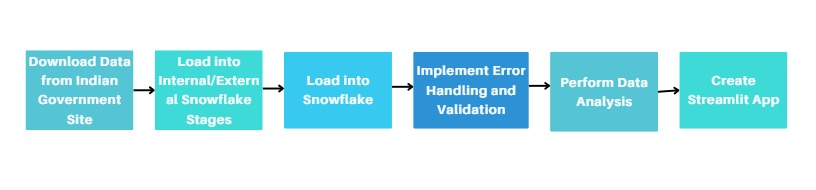

# Education and Employment Insights - SNOWFLAKE Hackathon

## Project Overview

This project analyzes education and infrastructure trends in India using Snowflake, Snowpark, and Streamlit. Insights focus on enrollment ratios, school facilities, drop-out rates, and sanitation progress from government datasets.

## Datasets Used:
1. **Physical Progress of the Total Sanitation Campaign During the Eleventh Plan (2007-08 to 2011-12)**
2. **School Education Statistics (2013-2016)**
   a. GER Data
   b. Boy's Toilet Information
   c. Girls Toilet Information
   d. Water Availability Information
   e. Drop-out Information

Both datasets were sourced from the [Open Government Data Platform India](https://data.gov.in).

## Tools and Platforms:
- **SnowSQL**: For loading and managing data using internal and external stages.
- **Snowpark**: For data analysis and extracting insights.
- **Streamlit**: For building the web application to display insights.
- **AWS S3**: Used as an external storage stage for data loading.
- **Snowflake Marketplace**: To explore and use third-party datasets for enhancing insights.

## Data Loading and Processing

### Data Loading Using External Stage (AWS S3):
1. **Download** the datasets from the official government sources.
2. **Upload** the dataset to an AWS S3 bucket.
3. **Create an External Stage** in Snowflake to point to your AWS S3 bucket.
4. **Load data** from AWS S3 into Snowflake tables using Snowflake's data loading capabilities.
5. **Verify the data** by querying the Snowflake tables.

### Data Loading Using Internal Stage:
1. **Download** the dataset locally from official sources.
2. **Upload the file** to an internal Snowflake stage using SnowSQL.
3. **Create an Internal Stage** in Snowflake.
4. **Load data** into Snowflake tables from the internal stage.
5. **Verify the data** by running queries to ensure correct loading.

### Data Processing:
- **Snowpark** is used to process and manipulate the data in Snowflake. It helps extract meaningful insights from complex datasets.
- **Exploratory Data Analysis (EDA)** was performed to uncover trends, relationships, and insights, such as:
    - Gross Enrollment Ratios (GER) for Primary, Upper Primary, Secondary, and Higher Secondary education.
    - Trends in school infrastructure (toilet and water facilities).
    - Drop-out rates across states and years.
- **Data cleaning** was performed to ensure accuracy and consistency. Handling missing values, removing duplicates, and standardizing data were part of this step.

---

## Streamlit Application

The insights were visualized and shared via a **Streamlit application**, which was integrated with Snowflake. The app displays the data trends and findings, offering an intuitive and interactive interface to explore

## Features Implementation:

- [x] Use **internal/external stages** in Snowflake to load raw data.

- [x] Use **SnowSQL** for loading data into Snowflake.

- [x] Load data from **AWS S3** into Snowflake as an external stage.

- [x] Use **SQL Worksheet** to query and manage data.

- [x] Use **Python Worksheet** to write Snowpark Python scripts for EDA.
    
- [x] Build a **Streamlit app** to display insights and trends derived from Snowflake.

- [ ] **Dynamic Tables and Task Scheduling**:  
  Use Snowflake’s dynamic tables and task scheduling to automate the update of insights with the latest data.
  
- [x] **Logs and Latency Checks**:  
  Implement logging to track and minimize query latency for efficient data processing.
  
- [x] **Data Quality - Data Cleaning**:  
  Clean the data by removing duplicates, fixing missing values, and ensuring accuracy.
  
- [ ] **Performance Optimization**:  
  Utilize Snowflake's query acceleration service, search optimization, and batch processing for performance enhancement.
  
- [ ] **Change Data Capture (CDC) Pipeline**:  
  Integrate a CDC pipeline to monitor source data changes and keep the analysis updated.

- [x] **Integration of Snowflake Marketplace into Existing Pipeline**:  
    Enrich your existing data pipeline by integrating external datasets from the Snowflake Marketplace, merging them with the current analysis to provide deeper insights and comparisons.

---

## Insights from the Analysis:

### 1. **Education and Infrastructure Trends (2013-2016)**

- **Gross Enrollment Ratio (GER)**:  
  - GER follows a consistent pattern: Primary > Upper Primary > Secondary > Higher Secondary.  
  - Tamil Nadu leads in GER, while Delhi has the lowest.

- **School Infrastructure**:  
  - **Boys Toilets**: Majority of states have above-average coverage, with Tripura having the highest and Nagaland the lowest.
  - **Girls Toilets**: Similar trend, with Tamil Nadu leading and Mizoram trailing.
  - **Water Availability**: Strong coverage across the country, led by Delhi, with Nagaland at the bottom.

- **Drop-out Rates (2012-2015)**:  
  - Higher secondary levels show an increase in drop-out rates across many states.  
  - Nagaland reports the highest drop-out rates, while Pondicherry has the lowest.

### 2. **Sanitation Campaign Insights (2007-2012)**

- **Annual Progress of IHHL (Individual Household Latrines)**:
  - The highest progress in IHHL construction occurred in 2009-10, with 12,407,778 IHHLs built.
  - The lowest progress was in 2008-09, with 11,265,882 IHHLs constructed.

- **IHHL BPL and APL Insights**:
  - For BPL (Below Poverty Line) households, the maximum IHHL constructed was 6,155,933, while the minimum was 5,570,899.
  - For APL (Above Poverty Line) households, the maximum IHHL was 6,538,170, while the minimum was 5,694,983.

---

